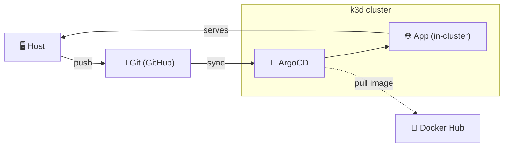

# Inception of Things — Part 3: GitOps Continuous Deployment

A self-contained GitOps pipeline: a single host bootstraps a local Kubernetes cluster, installs ArgoCD into it, and hands ArgoCD a Git repository to watch. From that point on, the cluster's state is a *function of the repo* — push a change, ArgoCD pulls it and reconciles the cluster to match, no manual `kubectl apply` required.

## Architecture



The loop: the host pushes manifest changes to GitHub → ArgoCD, running inside the k3d cluster, detects the drift and syncs → ArgoCD pulls the referenced container image from Docker Hub and applies the manifests → the resulting app is reachable from the host through the cluster's ingress. Deleting resources by hand or editing the live cluster state doesn't stick — ArgoCD's self-heal reverts it back to whatever Git says.

## What's actually being deployed

| Component | Purpose |
|---|---|
| **k3d cluster** (`cd-cluster`) | Single-node k3s-in-Docker cluster, with the internal Traefik ingress exposed on host port `8000` |
| **ArgoCD** | Installed from the upstream manifest into the `argocd` namespace; watches a Git repo and continuously reconciles the cluster to match it |
| **`nhayoun-playground`** | The demo application ArgoCD manages — a Deployment + Service + Ingress in the `dev` namespace, image `goslinabil/3kcube` |

## Repository layout

```
.
├── exec.sh                    # entrypoint: env setup, then infra bootstrap
├── container-env.sh           # installs Docker, k3d, kubectl on the host
├── infra.sh                   # creates the cluster, installs ArgoCD, wires up the app
├── test-cd.py                 # exercises the CD loop (self-heal / sync-on-push)
└── confs/
    ├── bootstrap/
    │   ├── namespaces.yml         # argocd, dev
    │   ├── argocd-cm.yml          # reconcile timeout, insecure server flag
    │   ├── argocd-ingress.yml     # exposes ArgoCD UI at argocd.localhost
    │   └── application.yml        # the ArgoCD Application pointing at this repo
    └── app/
        ├── deployment.yml         # nhayoun-playground Deployment
        ├── service.yml            # ClusterIP Service, port 8885
        └── ingress.yml            # exposes the app at playground.localhost
```

## Prerequisites

- A Fedora (or other `dnf`-based) host with `sudo` access
- Outbound internet access (Docker Hub, GitHub, the upstream ArgoCD manifest)
- Ports `80`/`8000` free on the host

## Bootstrapping the whole thing

```bash
./exec.sh
```

This is a two-stage process, split so environment setup and infra provisioning stay independently rerunnable:

**1. `container-env.sh` — host environment**
Installs Docker Engine from the official repo, enables the daemon, adds the current user to the `docker` group, then installs `k3d` and `kubectl` if they're not already present. Because group membership doesn't take effect in the current shell without a re-login, the script verifies Docker access via `sg docker -c "docker ps"` rather than assuming the new group is live.

**2. `infra.sh` — cluster + GitOps bootstrap**
Runs under `sg docker` from `exec.sh` for the same group-membership reason. In order:

1. Tears down any existing `cd-cluster` (`k3d cluster delete ... || true`) so re-runs start clean.
2. Creates a new k3d cluster with `-p "8000:80@loadbalancer"` — this maps host port 8000 to port 80 on the cluster's load balancer, which is where the in-cluster Traefik ingress listens. Every ingress host rule in this repo is reachable through that one mapped port.
3. Waits 10s for the cluster to stabilize, then confirms with `kubectl get nodes`.
4. Applies `namespaces.yml` (`argocd`, `dev`).
5. Installs ArgoCD from the upstream stable manifest (`--server-side --force-conflicts`, applied directly into the `argocd` namespace).
6. Applies `argocd-cm.yml` to override two defaults:
   - `timeout.reconcile` / `timeout.hard.reconciliation` dropped to `10s` (from ArgoCD's default of 3m) so sync-on-push is fast enough to demo/test without a long wait.
   - `server.insecure: "true"` on `argocd-cmd-params-cm` — the ArgoCD server serves plain HTTP instead of self-signed HTTPS, since Traefik is terminating the ingress locally and there's no reason to layer TLS on top for a local cluster.
7. Waits for the `argocd-server` pod to report `Ready` before continuing.
8. Extracts and prints the auto-generated initial admin password (`argocd-initial-admin-secret`, base64-decoded) — this is the only place that password is surfaced, so it needs to be copied from the terminal output at bootstrap time.
9. Applies `application.yml` — this is the step that actually hands control to ArgoCD. It's an ArgoCD `Application` resource pointing at this repo (`main`, path `.`), targeting the `dev` namespace, with `automated: { prune: true, selfHeal: true }`. From this point on, ArgoCD owns the `dev` namespace's state.
10. Applies `argocd-ingress.yml` to expose the ArgoCD UI itself at `argocd.localhost`.

## Accessing things

| What | URL | Notes |
|---|---|---|
| ArgoCD UI | `http://argocd.localhost:8000` | user `admin`, password printed during step 8 above |
| Playground app | `http://playground.localhost:8000` | served by the app ArgoCD deployed |

Both resolve through the same k3d load-balancer port mapping — `*.localhost` hostnames route to `127.0.0.1` by default on most systems, and Traefik dispatches based on the `Host` header from there.

## Proving the CD loop actually works

`test-cd.py` automates the two ways you'd normally verify a GitOps setup by hand:

```bash
python test-cd.py delete   # wipe dev namespace resources, confirm ArgoCD recreates them
python test-cd.py update   # toggle the image tag v1 ↔ v2 in deployment.yml, commit, push
```

Both modes hit the playground endpoint before and after, sleep 45s (the reconcile window), then hit it again — giving a before/after comparison in the terminal output.

- **`delete`** tests **self-heal**: manually deleting the Deployment/Service/Pods should not be a persistent change. ArgoCD notices the live state has drifted from Git and puts it back.
- **`update`** tests **sync-on-push**: nothing is touched on the cluster directly. The only action is committing a new image tag to Git — if the endpoint's response changes after the wait, that confirms ArgoCD picked up the commit on its own and reconciled the live Deployment to match, closing the loop shown in the diagram above.

## Design decisions worth calling out

- **Single host-port mapping (`8000:80@loadbalancer`)** keeps the whole stack reachable through one port instead of exposing NodePorts per-service, and mirrors how a real ingress controller would sit in front of multiple apps.
- **`sg docker` instead of a fresh shell/relogin** avoids forcing the user to log out mid-script just to pick up new group membership — `sg` runs the target command with the group applied for that invocation only.
- **Reconcile timeout tuned to 10s** is a deliberate trade-off: it's far too aggressive for a production ArgoCD install (needless API load at scale), but for a local single-app cluster it turns "wait a few minutes to see if sync worked" into something testable in under a minute.
- **Idempotent cluster teardown at the start of `infra.sh`** means the whole bootstrap can be re-run from a completely broken state without manual cleanup.